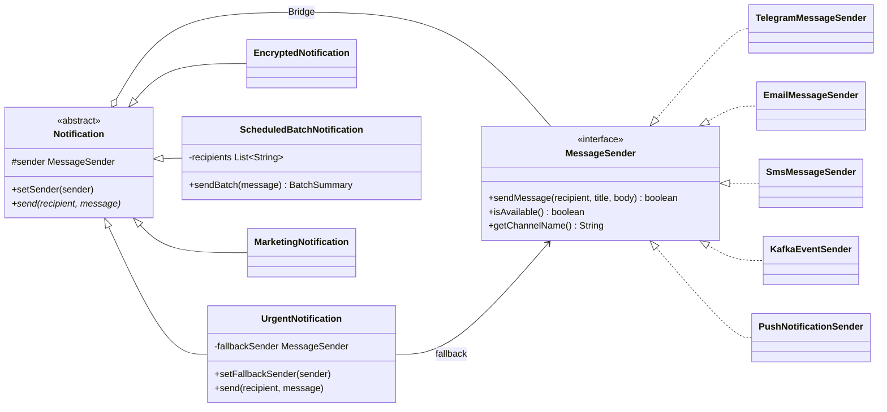

# Assignment 3 — Multi-Channel Notification Gateway

**Course:** Software Design Patterns  
**Pattern:** Bridge  
**Language:** Java 17  
**Student:** Nursultan Malgazhdar, SE-2516

## Overview

This project is a simulated notification gateway. A notification type decides what
must happen to a message, while a message sender decides how it is delivered. The
two parts are connected through the `MessageSender` interface and can change
independently.

No real Telegram, email, SMS, Kafka, or push service is contacted. Every provider
prints its result to the console and stores delivered messages in memory so that
the behavior can be tested.

## Build and run

Requirements:

- JDK 17 or newer
- Maven 3.9 or newer

Run the tests:

```bash
mvn clean test
```

Build and run the demo:

```bash
mvn clean package
java -cp target/classes kz.aitu.notificationgateway.NotificationGatewayDemo
```

The demo includes all required scenarios:

1. `UrgentNotification` with Telegram
2. `EncryptedNotification` with Email
3. `ScheduledBatchNotification` with SMS
4. Runtime switching from Telegram to Email
5. Unavailable Telegram with SMS fallback
6. `MarketingNotification` with `PushNotificationSender`

## Provider behavior

| Provider | Simulated behavior |
|---|---|
| Telegram | Adds simple Markdown-style formatting |
| Email | Preserves the title and adds a signature |
| SMS | Rejects messages longer than 160 characters |
| Kafka | Publishes a text representation of a notification event |
| Push Notification | Produces a compact mobile push message |

## UML class diagram



The same diagram is also available as PlantUML source in
[`docs/class-diagram.puml`](docs/class-diagram.puml).

## Bridge pattern roles

- **Abstraction:** `Notification`
- **Refined Abstractions:** `UrgentNotification`, `EncryptedNotification`,
  `ScheduledBatchNotification`, and `MarketingNotification`
- **Implementor:** `MessageSender`
- **Concrete Implementors:** Telegram, Email, SMS, Kafka, and Push senders
- **Bridge:** the `sender` field inside `Notification`

## Design questions

### What are the two independent dimensions?

The first dimension is notification behavior: urgent, encrypted, batch, or
marketing. The second dimension is the delivery provider: Telegram, Email, SMS,
Kafka, or Push Notification.

### Where exactly is the Bridge?

The bridge is the composition relationship from `Notification` to
`MessageSender`. A notification delegates delivery to its current sender through
the interface instead of inheriting provider-specific behavior.

### Why is inheritance problematic here?

Using inheritance for both dimensions would require one class for every
combination, such as `UrgentTelegramNotification` and
`EncryptedEmailNotification`. With N notification types and M providers, this
produces N × M classes and duplicates logic.

### What happens when a new provider is added?

A new provider implements `MessageSender`. Existing notification classes do not
need to change. `PushNotificationSender` demonstrates this extension.

### What happens when a new notification type is added?

A new notification type extends `Notification` and can immediately use every
existing sender. `MarketingNotification` demonstrates this extension.

### Why is this Bridge rather than Adapter?

Bridge separates two dimensions of the design from the beginning so that both
can evolve independently. Adapter is normally used later to make an existing,
incompatible API match an interface expected by the client.

## Tests

The JUnit 5 suite contains 14 tests covering:

- successful delivery and unavailable providers;
- primary and fallback behavior;
- the 160-character SMS limit;
- Base64 message transformation;
- batch totals, successes, and failures;
- runtime provider switching;
- Push and Marketing extensions;
- Kafka event simulation.

